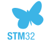

### Hi there 👋

- 🔭 I’m currently working on:
  - `Matter Thermostat` by [`Schneider Electric`][company-link] - A smart home device
  - `Animal Tracker` using ESP32, LoRa, GNSS, IMU and Magnetometer (AHRS / MARG)

- 🌱 I’m currently learning:
  - `SiWG917` and `EFR32MG24` microcontrollers and Silicon Labs ecosystem (Simplicity SDK, WiSeConnect SDK) [][siwg917-link]

- 🤔 I’m looking for help with:
  - `Embedded Programming` - architecture, hints, tips, and best practices
  - `Electronics Design` - hints, tips, and best practices
  - `C++` -  modern features

- 💬 Ask me about:
  - `Espressif`, `ESP32` microcontrollers and `ESP-IDF` [][esp-idf-link]
  - `STM32` [][stm32-link]
  - `FreeRTOS` [][freertos-link]
  - `C++` 

 

<!--  -->

<!--   -->

 

<!-- Links -->
[company-link]: https://www.se.com/uk/en/home/smart-home/wiser/homeowner.jsp "Schneider Electric Wiser website"
[siwg917-link]: https://www.silabs.com/wireless/wi-fi/siwx917-wireless-socs "SiWx917"
[stm32-link]: https://www.st.com/en/microcontrollers-microprocessors/stm32-32-bit-arm-cortex-mcus.html "STM32"
[freertos-link]: https://www.freertos.org/ "FreeRTOS"
[esp-idf-link]: https://github.com/espressif/esp-idf "ESP-IDF"

<!--
**ElliottWaterman/ElliottWaterman** is a ✨ _special_ ✨ repository because its `README.md` (this file) appears on your GitHub profile.

Here are some ideas to get you started:

- 🔭 I’m currently working on ...
- 🌱 I’m currently learning ...
- 👯 I’m looking to collaborate on ...
- 🤔 I’m looking for help with ...
- 💬 Ask me about ...
- 📫 How to reach me: ...
- 😄 Pronouns: ...
- ⚡ Fun fact: ...
-->
